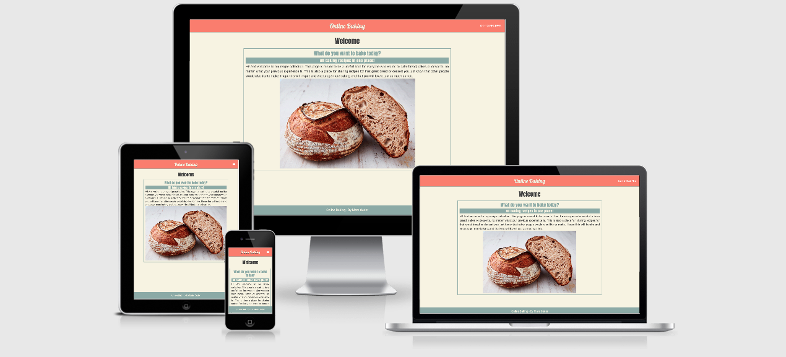

# Online Baking - Recipe Database

This is an online recipe database for all things baked. It gives users the options of creating and manipulate recipes, as well as browsing for inspiration. Hopefully this can be a growing source of information and a good tool for a user who want's expand their knowledge and keep track of what they've done earlier. The more it's being used, the better it will be for everyone!

I've made this project as my data centric development milestone project, for the Code Institute fullstack web developer program. 
Using knowledge from earlier parts of the cours, and combining it with Python3 and Jinja to show that I've understood and can set up a NoSQL database and connect it to a web application.

The project is hosted on [Github](https://github.com/matsceder/dcdmp-mec-bake) and deployed with [Heroku](https://dcdmp-mec-bake.herokuapp.com/)

## UX
### Design, Mockups and Responsiveness

The design of this project is meant to be simple, with a palate of colors inspired by the cookbooks in the kitchen when I was a kid. It should be easy for anyone to find what they're looking for and navigate easily throughout the page. It's been made with responsive and defensive design in mind, built with mobile first approach. A mockup was made using Figma, where colors and fonts were selected from start, so it would be easier to avoid deviations from the intentions. From there it got even simpler as the page came alive and I wanted do keep down the amount of different colors even more. Frameworks, icons and other sources, is found further down in the document.

#### Wireframes for the different devices: 
- [Mobile](https://www.figma.com/file/iHfhgwJzJyhBJNbnp3ZE7Q/dcdmp-mec-online-baking?node-id=0%3A1),
- [Tablet](https://www.figma.com/file/iHfhgwJzJyhBJNbnp3ZE7Q/dcdmp-mec-online-baking?node-id=2%3A2),
- [Desktop](https://www.figma.com/file/iHfhgwJzJyhBJNbnp3ZE7Q/dcdmp-mec-online-baking?node-id=2%3A3)

### User Stories

The purpose of this is for it to be a simple and accessible database for users no matter what their level of skill might be. Here's a few examles of probable users.

- As a user with a limited experience from baking, I want to look for inspiration and be able to browse through recipes and sorting out those that are too hard. 
- Aa a slightly more advanced user, I want to perfect that super delicious recipe. Seeing the recipe as a living thing, where small tweaks can be made and easily updated and documented. Getting closer to perfection, step by step.
- A more experienced user who keeps the old family recipes in the memory. That user might be tired of having to write it down every time someone asks for that delicious pie recipe. So now they add the recipe one time, and then they just share the link with friends and family who ask. And with the added benefit that it wont be forgotten.

## Features
This is hopefuly just the beginning of this. I'm hoping this will expand over time, the goal is to maintain and improve the existing features, but also adding new features to make it more usefull and optimized.
### Existing features
- Documentation - README.md and Mockups
- Responsive design - Mobile first application
- Materializecss - Front-end Framework
- Heroku - App deployment
- Git - Version control
- Github - Remote repository
- MongoDB - NoSQL Database
    - Create, Read, Update and Delete recipes

### Planned features and improvements
- User accounts
- Admin controll of removing data
- Commenting sections
- Rating system
- Personal comments and notes to recipes
- Storing multiple modified versions of recipes
- Descriptions of different techniques
- Video showing different techniques or steps in the proces
- Printable PDF-versions of recipes
- Links to related items or products
    - Affiliate links
- Improved functionallity and more efficient code

## Deployment
#### This page is deployed using [Heroku](https://www.heroku.com/). Following steps describes the process of deployment.
1. Create a repository, either localy or as in my case, on GitHub.
2. Create a simple app in python using Flask and have it return "Hello World!".
3. Log on to Heroku and create a new app.
4. Connect and log in to Heroku through your terminal. 
5. Set up a requirements.txt-file and also create a Procfile.
6. Follow the steps provided by Heroku inside your app-project in the browser. Initiate a new repo, make an initial commit and push it to Heroku.
7. Set your dyno from the dashboard by typing in $ Heroku ps:scale web=1.
8. On Heroku web page, go to settings and set up your environment variables under "config vars". Add IP and PORT values and save it.
9. Click on "Open App", and it shoudl pop out a new tab in your browser displaying the deployed app.

## Testing
Keeping the app simple and using Materialize's built in functionality resulted in front-end testing being done fully manual. 
- HTML and CSS have been validated and formatted.
- All objects with functions have been tested and work as intended.
- Responsiveness tested using Google Dev tools, all their avaliable device-displays has been tested and the app responds well in order to work with all of them. 
- As far as connecting with the database via the app goes, its been tested several times, and it carries out the basic functions of CRUD, Create, Read, Update and Delete without problems.

BACK-END TESTING - PYPI AND ROUTING?

## Credits
### Technologies and sources used

- [HTML](https://developer.mozilla.org/en-US/docs/Web/HTML) - Basic structure is built using simple HTML
- [CSS](https://developer.mozilla.org/en-US/docs/Web/CSS) - Is used for styling
- [Python3](https://www.python.org/) - Connecting database with user
- [Flask](https://flask.palletsprojects.com/en/1.1.x/) - App routing and template engine
- [Jinja2](https://palletsprojects.com/p/jinja/) - Configured through Flask, controlling template engine
- [Materializecss](https://materializecss.com/) - Front-end Framework, styling and functionality
- [JQuery](https://jquery.com) - Simplifying DOM manipulation.
- [GitHub](https://github.com/) - Hosting repository
- [GitPod Workspaces](ttps://www.gitpod.io/) - Real time development in browser
- [Google Chrome](https://www.google.com/chrome/) - Using Dev tools, manual testing while developing
- [Google](https://www.google.com/) - Research and troubleshooting
- [Google Fonts](https://fonts.google.com/) - Library for all fonts in the app
- [Font Awesome](https://fontawesome.com/) - Used to complement icon library
- [Am I Responsive](http://ami.responsivedesign.is) - Test and display of responsiveness
- [W3C Markup Validation Service](https://validator.w3.org/) - Validation of HTML and CSS
- [MongoDB](https://www.mongodb.com/) - NoSQL Database
- [Heroku](https://www.heroku.com/) - Deployment of app
- [SchemeColor](https://www.schemecolor.com/sneaky-peaky.php) - Color theme
- [Figma](https://www.figma.com/) - Making of wireframes / mockups

### Content
- [CodePen user - Zzzian](https://codepen.io/zzzian/pen/LZbrOP?__cf_chl_jschl_tk__=9f40e82f349b34dced5fbc0b11a97f5969501ed9-1591793304-0-ASUvdpx3C2k4XIVdDrz1kTsYyLPZQPJvvsDZN_ftPSKxKo6JcIl-bBoWt8rwxjMJTTVPwLV0c-WrdfZ7jpVCIw6BfgaouE3pm8idfIavtCaKvmtfzfGTC_9UsVJQujnFgiDus_6E47c7zKqK29pR2YntDM2jfkgS_iHKfI0adPFCaBJrAPFaWZ2Dx_1iRkXewtETaBXxn-ghaIGHN6BvPZdkglwwiztxeCSaHKvSNXCXuHZqZh9EL2XJ2RnWPE7YP5jAuMFRNjasbm-Rth6xVCFkzY9BIAG-Nx5JC-h-0rFnPgn0YLhszXVfyn0FDNn9Nj_lcg_pCsz-1pGu5l9a3_uUW0pbdtTg7xQbOTa12Im1) - Code used for form in new recipe template
- [Delish](https://www.delish.com/cooking/recipe-ideas/a25810151/how-to-make-sourdough-bread-recipe/) - Image for index page
- Recipes
    - [Mitt Kök](https://mittkok.expressen.se/recept/glutenfritt-bananbrod/) - Bananabread
    - [BBC Good Food](https://www.bbcgoodfood.com/recipes/easy-white-bread) - Easy White Bread
    - [Recipe-tin-eats](https://www.recipetineats.com/easy-yeast-bread-recipe-no-knead/) - No Knead Bread
    - [All Recipes](https://www.allrecipes.com/recipe/13477/double-layer-pumpkin-cheesecake/?internalSource=hub%20recipe&referringId=276&referringContentType=Recipe%20Hub&clickId=cardslot%2010) - Double Layer Pumpkin Cheescake
    - [All Recipes](https://www.allrecipes.com/recipe/169305/sopapilla-cheesecake-pie/?internalSource=hub%20recipe&referringId=276&referringContentType=Recipe%20Hub&clickId=cardslot%2018) - Sopapilla Cheesecake Pie
    - [All Recipes](https://www.allrecipes.com/recipe/17981/one-bowl-chocolate-cake-iii/?internalSource=hub%20recipe&referringId=276&referringContentType=Recipe%20Hub&clickId=cardslot%2012) - One Bowl Chocolate Cake
    - [Nordic Food Living](https://nordicfoodliving.com/danish-rye-bread-without-sour-dough/) - Danish Rye Bread
    - [King Arthur Flour](https://www.kingarthurflour.com/recipes/japanese-milk-bread-rolls-recipe) - Japanese Milk Bread
    - [Mitt Kök](https://mittkok.expressen.se/recept/tortillabrod-3/) - Tortilla Bread

### Acknowledgements
- Seun Owonikoko @seun_mentor - My mentor at Code Institute
